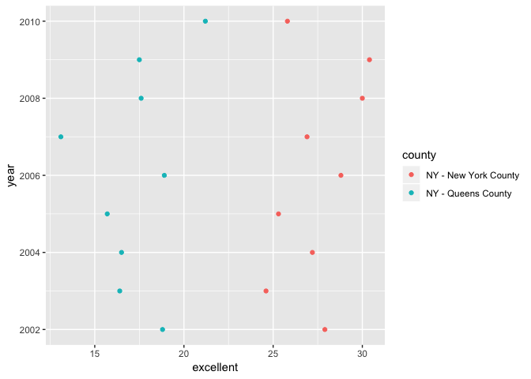

p8105\_hw2\_xz2788
================
Xiaoyue Zhang
9/26/2018

Loading packages
================

``` r
library(tidyverse)
library(readxl)
```

Problem 1
=========

Import and tidy data:

``` r
transit_data = read_csv(file = "./data/NYC_Transit_Subway_Entrance_And_Exit_Data.csv",
                        col_types = "cccddccccccccccccccccclclcccddcc") %>% janitor::clean_names()
```

Look at the data first:

``` r
View(transit_data)
head(transit_data)
tail(transit_data)
str(transit_data)
skimr::skim(transit_data)
```

Select the data needed:

``` r
transit_data_clean = select(transit_data, line:entry, vending, ada)
```

Convert "entry" and "vending" into logical variables:

``` r
transit_data_clean$entry = ifelse(transit_data_clean$entry == "YES", TRUE, FALSE)
transit_data_clean$vending = ifelse(transit_data_clean$vending == "YES", TRUE, FALSE)
```

Remove duplicated rows by station name and line:

``` r
transit_data_clean = distinct(transit_data_clean, station_name, line, .keep_all = TRUE)
```

Review this new dataset:

``` r
str(transit_data_clean)
View(transit_data_clean)
```

Get the dimension of the new dataset

``` r
dim(transit_data_clean)
```

    ## [1] 465  19

Description of this dataset:
----------------------------

This dataset is about the New York City Transit data and contains 32 variables and 1868 records. It gives the information about the exit, entrance, metro routes served at each station and the equipment in each exit and entrance. Station location (latitude/longitude) and entrance location are numeric variables, "free\_crossover", "entry" and "ada" are logical variables. All of the others are character variables.

Process of data cleaning:
-------------------------

Firstly specifying the column type when importing the data then I used janitor::clean\_names to clean tha names. After looking at data, I selected the variables needed to a new dataset and converted "entry" and "vending" variables into logical ones for future analysis. Lastly, I've removed all the duplicated rows from the dataset since we only had to focus on the entry of each station other than the mutiple exits from each station.

The dimension of this dataset is 465 \* 19. This is not yet a tidy data since the routs served at each station should be classified into each train route instead of just enumerating.

Answers to the related questions in HW2:
----------------------------------------

``` r
nrow(transit_data_clean)
```

    ## [1] 465

1.  There are in total 465 distinct stations in the data.

``` r
filter(transit_data_clean, ada == TRUE) %>% nrow()
```

    ## [1] 84

1.  There are 84 stations are ADA compliant.

``` r
nrow(filter(transit_data, entry == "YES", vending == "NO"))/nrow(filter(transit_data, vending == "NO"))
```

    ## [1] 0.3770492

1.  The proportion of station entrances / exits without vending allow entrance is 0.377.

Reformating data:

Make route number and route name two distinct variables:

``` r
transit_data_reformat = gather(transit_data_clean, key = route_number, value = route_name, route1:route11)
```

Filter the rows and remove duplicated ones:

``` r
filter(transit_data_reformat, route_name == "A") %>% distinct(station_name, line, .keep_all = TRUE) %>% nrow()
```

    ## [1] 60

``` r
filter(transit_data_reformat, route_name == "A") %>% distinct(station_name, line, .keep_all = TRUE) %>% filter(ada == TRUE) %>% nrow()
```

    ## [1] 17

Therefore, 60 distinct stations serve the A train and 17 of these are ADA compliant.

Problem 2
=========

Import and tidy the Mr. Trash Wheel sheet:

``` r
trash_wheel_data = read_excel("./data/HealthyHarborWaterWheelTotals2018-7-28.xlsx", range = "A2:N338", sheet = 1) %>%
  janitor::clean_names() %>% 
  rename(weight = weight_tons, volume = volume_cubic_yards) %>% 
  filter(!is.na(dumpster))
```

Round the number of sports balls and convert into an integer variable:

``` r
trash_wheel_data$sports_balls = round(trash_wheel_data$sports_balls) %>% 
as.integer(trash_wheel_data$sports_balls)
```

Look at the data first:

``` r
View(trash_wheel_data)
str(trash_wheel_data)
head(trash_wheel_data)
tail(trash_wheel_data)
skimr::skim(trash_wheel_data)
```

Import and tidy precipitation data for 2016 and 2017:

``` r
precipit_data_2017 = read_excel("./data/HealthyHarborWaterWheelTotals2018-7-28.xlsx", sheet = 4) %>% 
  janitor::clean_names() %>% 
  rename(month = precipitation_in, precipitation = x_1) %>% 
  na.omit() %>% 
  mutate(year = "2017")
precipit_data_2017$precipitation = as.numeric(precipit_data_2017$precipitation)
```

    ## Warning: NAs introduced by coercion

``` r
precipit_data_2017 = precipit_data_2017[-1,]
precipit_data_2017$precipitation = round(precipit_data_2017$precipitation, digits = 2)
precipit_data_2017$month = month.name
```

``` r
precipit_data_2016 = read_excel("./data/HealthyHarborWaterWheelTotals2018-7-28.xlsx", sheet = 5) %>% 
  janitor::clean_names() %>% 
  rename(month = precipitation_in, precipitation = x_1) %>% 
  na.omit() %>% 
  mutate(year = "2016")
precipit_data_2016$precipitation = as.numeric(precipit_data_2016$precipitation)
```

    ## Warning: NAs introduced by coercion

``` r
precipit_data_2016 = precipit_data_2016[-1,]
precipit_data_2016$precipitation = round(precipit_data_2016$precipitation, digits = 2)
precipit_data_2016$month = month.name  
```

Combine datasets:

``` r
precipit_data = bind_rows(precipit_data_2016, precipit_data_2017)
```

Describe these datasets:
------------------------

The "trash\_wheel\_data" consists of 14 variables and 285 observations. These variables are "dumpster, month, year, date, weight, volume, plastic\_bottles, polystyrene, cigarette\_butts, glass\_bottles, grocery\_bags, chip\_bags, sports\_balls, homes\_powered", mainly documenting dumpster number, weight and date of trash and its types from 2014 to 2018. This dataset is from the public "Mr. Trash Wheel" website.

The "precipit\_data" consists of 3 variables and 24 observations. The key variables are precipitation in each month of 2016 and 2017. This data is also from the public document of "Mr. Trash Wheel". The total precipitation in 2017 is 32.93 and the median number of sports balls in a dumpster in 2016 is 26.

Problem 3
=========

Loading package

``` r
devtools::install_github("p8105/p8105.datasets")
library(p8105.datasets)
library(readr)
```

View the data first:

``` r
str(brfss_smart2010)
head(brfss_smart2010)
tail(brfss_smart2010)
skimr::skim(brfss_smart2010)
```

    ## Warning in min(characters, na.rm = TRUE): no non-missing arguments to min;
    ## returning Inf

    ## Warning in max(characters, na.rm = TRUE): no non-missing arguments to max;
    ## returning -Inf

``` r
brfss_smart2010_tidy = janitor::clean_names(brfss_smart2010) %>% 
  filter(topic == "Overall Health") %>% 
  select(-class, -topic, -question, -sample_size) %>% 
  select(year:data_value) %>% 
  rename(state = locationabbr, county = locationdesc) %>% 
  spread(key = response, value = data_value) %>% 
  janitor::clean_names() %>% 
  mutate(more_than_good = excellent + very_good)
```

Answering questions:
--------------------

There are `nrow(distinct(brfss_smart2010_tidy, county, .keep_all = TRUE))` unique locations in the dataset.

``` r
distinct(brfss_smart2010_tidy, state, .keep_all = TRUE) %>% 
  nrow()
```

    ## [1] 51

``` r
count_(brfss_smart2010_tidy, "state", sort = TRUE)
```

    ## # A tibble: 51 x 2
    ##    state     n
    ##    <chr> <int>
    ##  1 NJ      146
    ##  2 FL      122
    ##  3 NC      115
    ##  4 WA       97
    ##  5 MD       90
    ##  6 MA       79
    ##  7 TX       71
    ##  8 NY       65
    ##  9 SC       63
    ## 10 CO       59
    ## # ... with 41 more rows

``` r
data_2002 = filter(brfss_smart2010_tidy, year == 2002)
median(data_2002$excellent, na.rm = TRUE)
```

    ## [1] 23.6

There are 51 states in the dataset, so every state is represented. NJ is observed most. The median of the “Excellent” response value in 2002 is 23.6.

Making plots:
-------------

``` r
ggplot(data_2002, aes(x = excellent)) + geom_histogram()
```

    ## `stat_bin()` using `bins = 30`. Pick better value with `binwidth`.

    ## Warning: Removed 2 rows containing non-finite values (stat_bin).


``` r
filter(brfss_smart2010_tidy, county %in% c("NY - New York County", "NY - Queens County")) %>% 
  ggplot(aes(x = excellent, y = year)) +
  geom_point(aes(color = county))
```


